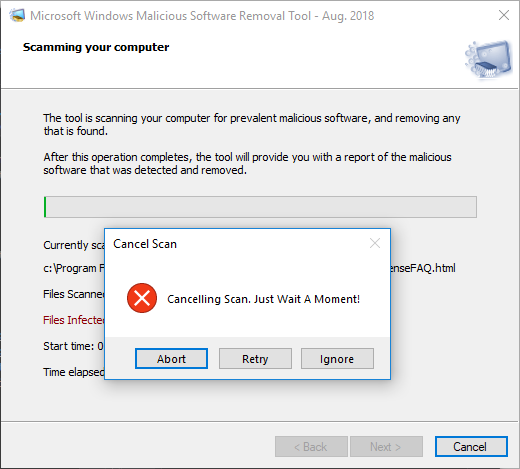

# MRT
Completely fake windows malicious file removal tool made for scambaiting purposes. 

Please have fun with it, tweak it, and just wait a moment.

Cancel button and X button won't allow the user to close.

Hit the pg-up key to immediately close the application.

Hit the pg-down key to start hanging. 

# Scan Modes

NormalScan : mimics normal scan

ForeverScan : never stops scanning - filecount increases 2000x faster

SuperSlowScan : normal scan with huge random delays between each file

SuperInfectedScan : normal scan but 1/100 files are infected

FastScan : scan completes in under a minute 

